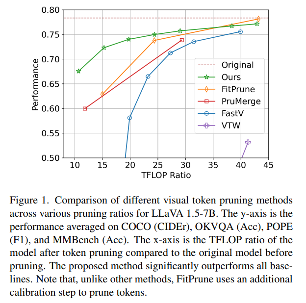

# ​​研究背景​​
**问题**：大型多模态模型（LMMs）在处理图像、视频等多模态数据方面表现出色，但其包含的视觉令牌数量庞大，显著增加了输入长度，导致推理复杂度和延迟增加。
**难点**：现有的视觉令牌剪枝方法要么需要大量的校准和微调，要么依赖于次优的重要性指标，导致保留的令牌之间存在冗余，影响模型性能。
**相关工作**：现有方法包括基于注意力分数的剪枝方法（如FastV和PruMerge）、基于校准的剪枝方法（如FitPrune和VTW）以及需要微调的方法（如M3）。这些方法在减少计算复杂度的同时，往往无法在不进行微调的情况下保持高性能。
## ​​研究方法​​
提出了DivPrune方法，将视觉令牌剪枝问题表述为最大-最小多样性问题（MMDP），目标是选择一组令牌，使得这些令牌之间的多样性最大化。

具体来说，DivPrune通过最大化所选令牌之间的最小距离来减少冗余，确保所选令牌能够更好地代表原始令牌集。该方法不需要微调或校准数据，是一种即插即用的解决方案。

在算法实现上，DivPrune分为两个阶段：首先选择第一个令牌，然后迭代地选择后续令牌，每次选择都基于当前候选令牌与已选令牌之间的最小距离。通过这种方式，DivPrune能够在不显著增加计算开销的情况下，选择出具有高多样性的令牌子集。
# ​​实验设计​​

在16个图像和视频理解数据集上对DivPrune进行了评估，包括COCO、OKVQA、POPE和MMBench等。
实验结果表明，DivPrune在极端剪枝比例（如≥80%）下仍能保持较高的模型性能。例如，在LLaVA 1.5-7B模型上，DivPrune在TFLOP比为15%时，COCO数据集的CIDEr得分仅下降12.7%，而VTW和FastV方法分别下降了95%和42.8%。

与现有方法相比，DivPrune在大多数数据集上表现出色，特别是在高压缩场景下，性能差距更加明显。例如，在LLaVA 1.5-13B模型上，DivPrune在POPE数据集上的F1得分比VTW、FastV和PruMerge分别提高了83%、53.4%和15.2%。
# ​​结果与分析​​
DivPrune在图像和视频理解任务中均表现出色，显著优于现有的剪枝方法。例如，在LLaVA-NeXT-Video-7B模型上，DivPrune在ActivityNet、SeedBench和EgoSchema数据集上的准确率分别比FastV和VTW提高了12%和19%。

在效率方面，DivPrune显著减少了GPU内存使用和推理延迟。例如，在LLaVA-NeXT-Video-7B模型上，DivPrune的内存使用量比原始模型减少了约400MB，预填充时间和端到端延迟分别比原始模型快了55%和22%。
# ​​总体结论​​
DivPrune通过最大化所选令牌的多样性，有效减少了冗余，能够在高剪枝比例下保持高性能，且不需要微调或校准数据。

实验结果表明，DivPrune在多种LMMs和数据集上均表现出色，显著提升了推理效率和模型性能，具有广泛的应用前景。